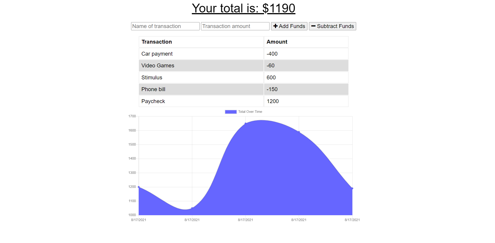

# Workout Tracker

## Table of Contents

- [Description](#description)
- [Usage](#usage)
- [Screenshot](#screenshots-of-working-application)
- [License](#license)
- [Credits](#credits)
- [Questions](#questions)

## Description

This application is a website where you can track your transactions both online and offline. The application allows the user to add transactions that either add or subtract funds from their total. The application also displays the user's transaction history in the form of a charts to visually display the history of their balance. All of the user's transaction history is stored to a database using MongoDB in the cloud via Mongo Atlas and the application is deployed to heroku. This application uses the Node and the Express module for setting up the server, the Mongoose module for connecting to the MongoDB database, and the Morgan module as a middleware HTML request logger. A service-worker.js file is used to cache all of the data so that it is still viewable in offline mode. IndexedDB is used to store the data that the user inputs while in offline mode and once they are back online, the data they entered while offline will update the database and the data will populate on their page.

Link to Deployed Application: [https://young-badlands-44575.herokuapp.com/](https://young-badlands-44575.herokuapp.com/)

## Usage

To use this application, the user would first navigate to the deployed Heroku website. Then, the user would enter a name of a transaction and the transaction amount. Depending on whether this transaction is one that is adding or subtracting funds from their balance, they would then click the correlating button. The transaction data will then immediately appear in the table below and the chart will update accordingly. If the user wants to try to input data while offline, they can right-click the page and click Inspect and then go to the Application tab. Then, they would click on Service Workers on the nav bar on the left side and click the box that says "Offline". If they then refresh the page, they will see that their data is still there because it has been cached. If the user wants, they can add a new transaction while in offline mode and it will be display even in offline mode. Then, if they uncheck the "Offline" box and refresh their page they will see that the data they entered in offline mode is still there and on the back-end has been added to the cloud database.

### Screenshots of Working Application

## License

This project is licensed under the [MIT License](https://opensource.org/licenses/MIT).

## Credits

This application was an assignment for the GA Tech Full Stack Web Development Coding Bootcamp. The starter code that was provided for this assignment is located in the public folder, not including the db.js file, manifest.webmanifest file, and service-worker.js file. Some of the starter code files were also edited for functionality purposes.

## Questions

If you have any questions about the repo, open an issue or contact me directly:

- Please contact me directly at my [GitHub](https://github.com/mcall0147)
- Or contact me by email at [mcallahanx93@gmail.com](mailto:mcallahanx93@gmail.com)
